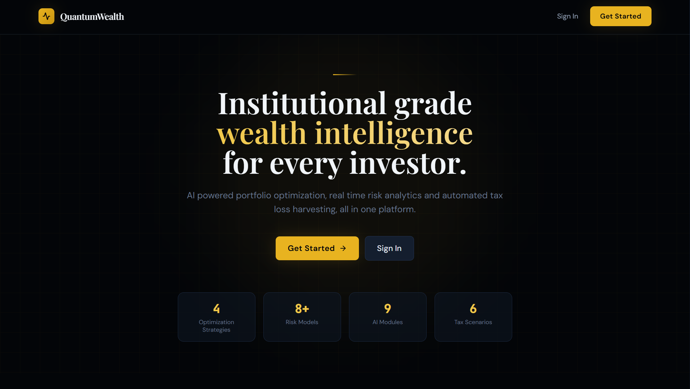

# QuantumWealth


## AI-Powered Wealth Management and Robo-Advisory Platform

QuantumWealth is a robo-advisory platform: a Django backend for accounts, advisor, market, portfolio, risk, and tax, paired with a React web dashboard and 9 genuinely implemented AI modules (portfolio optimization, risk, robo-advice, market prediction, tax optimization, sentiment, factor models, backtesting, and anomaly detection), each pulling real market data via yfinance and wired directly into the backend.

<div align="center">
  
</div>

## Table of Contents

- [Overview](#overview)
- [Project Structure](#project-structure)
- [Feature Status](#feature-status)
- [Technology Stack](#technology-stack)
- [Architecture](#architecture)
- [Installation and Setup](#installation-and-setup)
- [Running the Stack](#running-the-stack)
- [API Surface](#api-surface)
- [Testing](#testing)
- [CI/CD Pipeline](#cicd-pipeline)
- [Documentation](#documentation)
- [Contributing](#contributing)
- [License](#license)

## Overview

QuantumWealth demonstrates a robo-advisory workflow across a real, runnable codebase. All 9 AI modules are genuinely implemented, not aspirational: real cvxpy-based Black-Litterman and Hierarchical Risk Parity optimization, real Monte Carlo GBM simulation for VaR, and real VADER sentiment scoring with an honest fallback if the library isn't installed, and six of them are genuinely imported and called by the Django backend. CI currently only runs the backend's own 192 tests; the AI modules' separate 154-test suite isn't wired into the workflow.

## Project Structure

```
QuantumWealth/
├── code/
│   ├── backend/                    # Django application
│   │   ├── quantumwealth/          # Project config: settings, URLs
│   │   ├── apps/                   # accounts, advisor, market, portfolio, risk, tax
│   │   └── tests/                  # Backend test suite (run in CI)
│   └── ai_models/                  # 9 AI modules, 6 of them genuinely imported
│       ├── portfolio_optimizer/    # Mean-variance, Black-Litterman, risk parity, HRP
│       ├── risk_engine/            # Historical/parametric VaR, CVaR, Monte Carlo GBM
│       ├── robo_advisor/           # Goal planning (FV/PMT), ERC rebalancing
│       ├── market_predictor/       # GBM forecasting, regime detection, RSI/SMA
│       ├── tax_optimizer/          # Tax-loss harvesting, wash-sale calendar
│       ├── sentiment_analyzer/     # VADER news sentiment, with a fallback
│       │                           # if the library isn't installed
│       ├── factor_models/          # Fama-French 5-factor OLS, BHB attribution
│       ├── backtester/             # Event-driven simulation with transaction
│       │                           # costs and benchmark comparison
│       ├── anomaly_detector/       # Isolation Forest, z-score outliers
│       └── tests/                  # AI modules' own test suite (not run in CI)
├── frontend/                       # React (Vite) web dashboard
├── infrastructure/                 # Nginx config, PostgreSQL init
├── scripts/                        # setup.sh, backup_db.sh
├── docs/                           # Documentation (this directory)
├── docker-compose.yml              # Full stack: db, redis,
│                                   # celery worker/beat, backend,
│                                   # frontend build, nginx
└── README.md
```

## Feature Status

### Application tier (wired and tested)

| Component                  | Details                                                                                                                                                                |
| :------------------------- | :--------------------------------------------------------------------------------------------------------------------------------------------------------------------- |
| **API**                    | Django REST backend covering accounts, advisor, market, portfolio, risk, and tax apps, with Swagger UI and ReDoc served alongside the API.                             |
| **Portfolio optimization** | Real cvxpy-based mean-variance, Black-Litterman, risk parity, and Hierarchical Risk Parity optimization, pulling market data via yfinance.                             |
| **Risk engine**            | Historical VaR, parametric VaR, CVaR, a Monte Carlo GBM simulation, and 5 stress scenarios.                                                                            |
| **Robo advisor**           | Future-value and payment-based goal planning, Equal Risk Contribution rebalancing, and concentration detection.                                                        |
| **Market predictor**       | GBM price forecasting, rolling regime detection, and RSI plus SMA indicators.                                                                                          |
| **Tax optimizer**          | Greedy tax-loss harvest scheduling, an after-tax return model, and a wash-sale calendar.                                                                               |
| **Sentiment analyzer**     | Real VADER-based news sentiment scoring, combined with momentum, volume, and RSI into a composite signal, with a fallback to a neutral score if VADER isn't installed. |
| **Factor models**          | Fama-French 5-factor OLS regression, Brinson-Hood-Beebower performance attribution, and sector decomposition.                                                          |
| **Backtester**             | Event-driven simulation with transaction costs and benchmark comparison.                                                                                               |
| **Anomaly detector**       | Isolation Forest, z-score outlier detection, and wash-sale clustering.                                                                                                 |
| **Web dashboard**          | React app (Vite, plain JavaScript) with Tailwind CSS and Recharts, backed by Celery worker and beat containers for background and scheduled tasks.                     |

### Not currently exercised in CI

| Component                  | Details                                                                                                                                                                                                                                                                                 |
| :------------------------- | :-------------------------------------------------------------------------------------------------------------------------------------------------------------------------------------------------------------------------------------------------------------------------------------- |
| **AI modules' test suite** | `code/ai_models/tests` has its own 154-function pytest suite covering the risk engine, market predictor, portfolio optimizer, robo advisor, and other modules, but CI's `backend_tests` job only runs `pytest tests/` from `code/backend`, so this suite isn't exercised automatically. |

## Technology Stack

| Area                 | Technology                                                                                  |
| :------------------- | :------------------------------------------------------------------------------------------ |
| Backend              | Django, Django REST Framework                                                               |
| Data layer           | PostgreSQL, Redis (cache and Celery broker)                                                 |
| Background tasks     | Celery (worker and beat, both containerized)                                                |
| Quant / optimization | cvxpy (Black-Litterman, HRP, mean-variance, risk parity), SciPy, NumPy, pandas              |
| Market data          | yfinance                                                                                    |
| Sentiment            | VADER (vaderSentiment), with a neutral-score fallback if not installed                      |
| Anomaly detection    | scikit-learn (Isolation Forest)                                                             |
| Web frontend         | React 18, Vite, Tailwind CSS, Recharts                                                      |
| Infrastructure       | Docker, Docker Compose, Nginx                                                               |
| CI/CD                | GitHub Actions                                                                              |
| Testing              | pytest (backend, 192 tests, run in CI; the AI modules' 154 tests run locally but not in CI) |

## Architecture

```
Client
  └── frontend (React, Vite)          ── HTTP/JSON ──┐
                                                       ▼
Backend (Django)
  ├── Apps    accounts, advisor, market, portfolio, risk, tax
  ├── Background  Celery worker and beat (scheduled tasks)
  └── Data layer    PostgreSQL, Redis

AI modules (code/ai_models, imported directly by the backend apps)
  portfolio_optimizer · risk_engine · robo_advisor · market_predictor
  tax_optimizer · sentiment_analyzer · factor_models · backtester
  anomaly_detector
```

See [docs/architecture.md](docs/architecture.md) for detail.

## Installation and Setup

Prerequisites: Python 3.11+, Node.js 18+, and Docker.

Docker:

```bash
git clone https://github.com/quantsingularity/QuantumWealth.git
cd QuantumWealth
cp code/backend/.env.example code/backend/.env
# edit .env: set SECRET_KEY and DB_PASSWORD

docker compose up --build -d
docker compose exec backend python manage.py seed_demo_data
```

Local:

```bash
cd code/backend
python -m venv .venv && source .venv/bin/activate
pip install -r requirements.txt
cp .env.example .env
python manage.py migrate
python manage.py seed_demo_data
python manage.py runserver
```

## Running the Stack

```bash
docker compose up --build -d
```

| Service      | URL                           |
| :----------- | :---------------------------- |
| Swagger UI   | `http://localhost/api/docs/`  |
| ReDoc        | `http://localhost/api/redoc/` |
| Django Admin | `http://localhost/admin/`     |

Demo login: `demo@quantumwealth.ai` / `Demo1234!`

## API Surface

Full endpoint reference with request and response schemas is in [docs/api-reference.md](docs/api-reference.md), and interactively at `/api/docs/` (Swagger) or `/api/redoc/` once the API is running.

## Testing

```bash
# Backend (from code/backend)
pytest

# AI modules (from code/ai_models)
pytest
```

| Suite            | Test count | Run in CI             |
| :--------------- | :--------- | :-------------------- |
| `code/backend`   | 192        | Yes                   |
| `code/ai_models` | 154        | No, runs locally only |

See [docs/testing.md](docs/testing.md) for what each suite covers.

## CI/CD Pipeline

GitHub Actions (`.github/workflows/cicd.yml`) runs three jobs on push, pull request, and manual dispatch:

| Job                 | Depends on          | What it does                                                                                                                            |
| :------------------ | :------------------ | :-------------------------------------------------------------------------------------------------------------------------------------- |
| Code Quality Checks | -                   | Formatter checks across the repository                                                                                                  |
| Backend Tests       | Code Quality Checks | Runs `pytest tests/` from `code/backend` with coverage, and uploads the report as an artifact. Does not run the AI modules' test suite. |
| Frontend Build      | Code Quality Checks | Installs dependencies and produces the production web build (no test step)                                                              |

## Documentation

| Document                                           | Contents                                                      |
| :------------------------------------------------- | :------------------------------------------------------------ |
| [docs/overview.md](docs/overview.md)               | Platform goals, architecture, technology stack                |
| [docs/api-reference.md](docs/api-reference.md)     | Complete endpoint reference with request and response schemas |
| [docs/ai-models.md](docs/ai-models.md)             | Mathematical foundations for all AI and ML modules            |
| [docs/database-schema.md](docs/database-schema.md) | Full table definitions with column types and indexes          |
| [docs/architecture.md](docs/architecture.md)       | System design, request lifecycle, security model, scalability |
| [docs/developer-guide.md](docs/developer-guide.md) | Contributing guide, code style, testing patterns              |
| [docs/deployment.md](docs/deployment.md)           | Local, Docker, and production deployment instructions         |
| [docs/testing.md](docs/testing.md)                 | Test suite overview and instructions                          |

## Contributing

Open a pull request.

## License

This project is licensed under the MIT License - see the [LICENSE](LICENSE) file for details.
